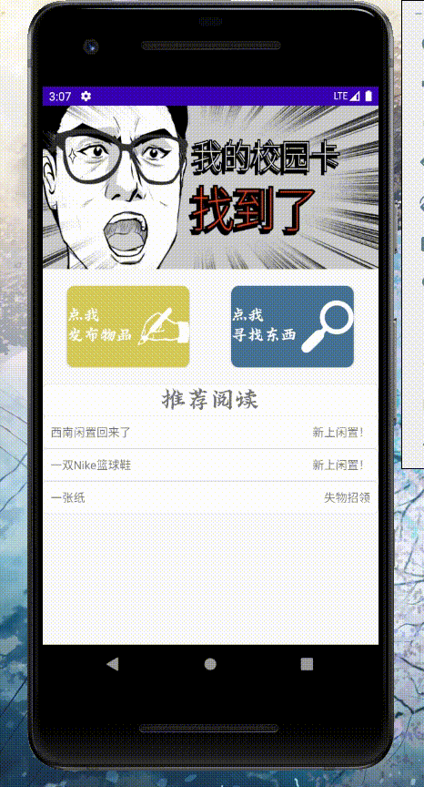

# 西南闲置APP
一个基于用Go编写的微信小程序后端开发的校园生活互助平台应用程序，拥有获取信息列表以及发布
信息两个功能模块。
  

# ScreenShot

 

 

## V2.0
### 版本日志
1.在搜索页面上使用tablayout + viewpager结构代替原来的togglebutton切换。 
 
### 实际演示 

## V1.95
### 版本日志
1.紧急修复一个图片加载bug，因为设置了setvisibility，会导致搜索页面中有时候图片会刷新不出来，对此bug进行了修复。  
 
### 实际演示 

## V1.9
### 版本日志
1.主页样式更改。  
2.搜索界面暂时由小红书样式改为ins样式，重写了gilde的into,使其可以加载原图大小，避免压缩。  
3.发布界面图片发布按钮样式位置更改，不加入图片时，图片不显示。  

### 存在问题
1.发布页空缺字段判断  
2.搜索页类型切换按钮  
### 实际演示 

## V1.8
### 版本日志
1.完全重做UI界面，将之前使用activity制作的界面改为了fragment，更加灵活，并使用bottomnav进行切换。
### 实际演示 

## V1.7
### 版本日志
1.完成了Glide对原有的URLImageView的替换，制作了加载时的淡出动画以及配置了加载前和加载失败的图片。

### 实际演示 

## V1.6
### 版本日志
1.将所有ListView架构替换成RecyclerView，并将搜索页面更换成瀑布流架构。  
2.微调细节页面的架构。  
3.更改UI颜色以及icon。

### 展望
1.利用Glide代替自定义URLImageView（首要任务）。  
2.制作menu替换按钮切换。

### 实际演示 

## V1.55
### 版本日志
1.修复一个小bug，发布界面的输入框用background="@null"替代minlines，以取消输入框下划线。  
2.对网络错误的处理进行了微调。

## V1.5
### 版本日志
应该是最近的最后一次更新，本次主要完成了两个功能：  
1.全面使用了rxjava + retrofit的方式去进行网络请求（采用了单例模式去进行调配）。  
2.搜索功能中的输入框被限定为一行。

### 实际演示 

## V1.45
### 版本日志
1.使用了rxjava对首页数据进行请求，稍后将应用到全局的网络请求当中。

参考：[https://gank.io/post/56e80c2c677659311bed9841](https://gank.io/post/56e80c2c677659311bed9841)

## V1.4
### 版本日志
1.将网络连接架构从okhttp3升级到retrofit2（未完全运用到json解析，因为bean与json没做到11对应）。  
2.将URLImageView里的HttpConnection升级到了retrofit2（使用byteStream()获取）。

参考：[https://my.oschina.net/tingzi/blog/3002269](https://my.oschina.net/tingzi/blog/3002269)

### 展望
1.点赞  
2.rxjava

## V1.3
### 版本日志
1.完成了对手机图片的读取（存在动态权限问题，需要在manifest注册然后再使用 ActivityCompat.requestPermissions 获取）。   
2.完成了对图片发送前的压缩，以满足服务端的限制（使用bm.compress)。  
3.完成了图片的发布（流程为先将图片使用MultipartBody发送到服务器，然后获取返回的数据，再将数据加入json中发送请求）。  

### 实际演示 

## V1.2
### 版本日志
1.完成发送界面的切换功能，现在发送界面可以切换到闲置物品页面。  
2.完成了对不正确金额输入的判定。

### 实际演示   

## V1.1
### 版本日志
1.完成搜索界面的切换功能，现在搜索界面可以切换到闲置物品页面。  
2.修复圆形头像绘制功能的bug，Xfermode绘制在返回fragment时会导致画面消失，原因在于saveLayer方法，改用BitmapShader实现避免了问题。

### 实际演示   

## V1.0
### 版本日志
1.完成了发布功能，可以在客户端发布相关的拾物信息了，照旧使用okhttp实现,意味着app基本功能已经全部实现。  
2.重新制作了UI。  
**总体**  
1.引入了外部字体(Typeface typeface = ResourcesCompat.getFont(this,R.font.az))    
2.移除了sharedprefercence机制     
3.优化cookie获取    
**主页**
1.viewpager中使用runnable + handler用于定时刷新banner   
2.更改了主页ListView的样式   
3.重写onresume实现刷新  
4.实现了下拉刷新（SwipeRefreshLayout）  
**搜索页**  
1.更改ListView间隔   
2.使用圆框头像（参考自[https://www.jianshu.com/p/a5be5d3a0a05](https://www.jianshu.com/p/a5be5d3a0a05)）  
3.实现了下拉刷新（SwipeRefreshLayout）  
**内容页**  
1.更改基本样式   
2.使用圆框头像（参考自[https://www.jianshu.com/p/a5be5d3a0a05](https://www.jianshu.com/p/a5be5d3a0a05)）   
**发布页**  
1.更改了样式  

### 接下来的任务
1.图片发送  
2.闲置物品  
3.点赞显示  

### 发布功能演示  

### 主页ViewPager自动刷新演示   

## V0.90
### 版本日志
1.完成了鉴权问题，每次启动时会获取cookie（使用okhttp的post），不需要再人工问后端小伙伴获取临时token，每次启动时先进行获取cookie，获取成功后使用handler调用requestIndex（）去刷新主页。  
2.发布功能已完成对象的包装，将进行网络通信的调试。

### 实际演示  

## V0.85
### 版本日志
1.改善了一下发布页面。  
2.完成了将输入内容转成json的操作（通过Gson的tojson）.

### 实际演示    

## V0.8
### 版本日志
1.完成了搜索界面的搜索框功能，通过handler动态刷新界面（不可以使用setArguments）。  
2.完成了发布页面的基本五毛框架设计。  

### 存在问题 
1.token时限和鉴权问题，后端小伙伴说没时间做，只能暂时使用临时token. 

### 实际演示   

## V0.7
### 版本日志
1.增加了全局搜索的页面（搜索框尚未完成）  
2.制作了LoadingDialog，参考自[https://github.com/gittjy/LoadingDialog](https://github.com/gittjy/LoadingDialog)  
3.修改了小部分界面设计问题  

### 存在问题
1.缓存和实时请求问题，请求速度有点慢，可进行缓存会失去实时性  
2.token时限和鉴权问题  
 
### 实际演示     

## V0.6
### 版本日志
1.通过后端小伙伴给的接口和token连上了详情页面，通过okhttp和gson抓取数据并渲染到详情页面中（使用了postman进行测试）  
2.加入sharedpreference作为缓存，减少请求次数  
3.参考网上代码,编写了MyImageView,可以通过url链接来异步加载图片（使用hanlder回传主线程），但后续还需要对图片进行压缩或者缓存处理。（[参考地址](https://blog.csdn.net/qq_33200967/article/details/77263062)）  

### 实际演示   

## V0.5
### 版本日志
1.根据小程序页面，初步绘制出五毛界面  
2.使用okhttp和gson抓取了首页的数据，并完成显示  
3.使用viewpager制作了首页的滑动图片效果  

### 实际演示   

