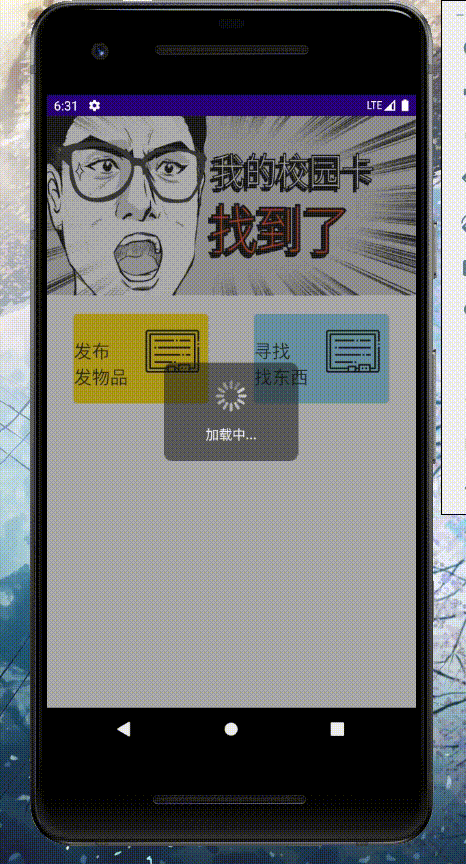

# 西南闲置app试作

## V1.2
### 版本日志
1.完成发送界面的切换功能，现在发送界面可以切换到闲置物品页面。  
2.完成了对不正确金额输入的判定。

效果如图：  

## V1.1
### 版本日志
1.完成搜索界面的切换功能，现在搜索界面可以切换到闲置物品页面。  
2.修复圆形头像绘制功能的bug，Xfermode绘制在返回fragment时会导致画面消失，原因在于saveLayer方法，改用BitmapShader实现避免了问题。

效果如图：  

## V1.0
### 版本日志
1.完成了发布功能，可以在客户端发布相关的拾物信息了，照旧使用okhttp实现,意味着app基本功能已经全部实现。  
2.重新制作了UI。  
**总体**  
1.引入了外部字体(Typeface typeface = ResourcesCompat.getFont(this,R.font.az))    
2.移除了sharedprefercence机制     
3.优化cookie获取    
**主页**
1.viewpager开辟了一条线程用于定时刷新banner   
2.更改了主页ListView的样式   
3.重写onresume实现刷新  
4.实现了下拉刷新（SwipeRefreshLayout）  
**搜索页**  
1.更改ListView间隔   
2.使用圆框头像（参考自//https://www.jianshu.com/p/a5be5d3a0a05）  
3.实现了下拉刷新（SwipeRefreshLayout）  
**内容页**  
1.更改基本样式   
2.使用圆框头像（参考自//https://www.jianshu.com/p/a5be5d3a0a05）   
**发布页**  
1.更改了样式  

### 接下来的任务
1.图片发送  
2.闲置物品  
3.点赞显示  

发布效果如图：  

主页ViewPager自动刷新效果如图：  

## V0.90
### 版本日志
1.完成了鉴权问题，每次启动时会获取cookie（使用okhttp的post），不需要再人工问后端小伙伴获取临时token，每次启动时先进行获取cookie，获取成功后使用handler调用requestIndex（）去刷新主页。  
2.发布功能已完成对象的包装，将进行网络通信的调试。

效果如图：  

## V0.85
### 版本日志
1.改善了一下发布页面。  
2.完成了将输入内容转成json的操作（通过Gson的tojson）.

效果如图：  

## V0.8
### 版本日志
1.完成了搜索界面的搜索框功能，通过handler动态刷新界面（不可以使用setArguments）。  
2.完成了发布页面的基本五毛框架设计。  

### 存在问题 
1.token时限和鉴权问题，后端小伙伴说没时间做，只能暂时使用临时token. 

效果如图：  

## V0.7
### 版本日志
1.增加了全局搜索的页面（搜索框尚未完成）  
2.制作了LoadingDialog，参考自[https://github.com/gittjy/LoadingDialog](https://github.com/gittjy/LoadingDialog)  
3.修改了小部分界面设计问题  

### 存在问题
1.缓存和实时请求问题，请求速度有点慢，可进行缓存会失去实时性  
2.token时限和鉴权问题  
 
效果如图：    

## V0.6
### 版本日志
1.通过后端小伙伴给的接口和token连上了详情页面，通过okhttp和gson抓取数据并渲染到详情页面中（使用了postman进行测试）  
2.加入sharedpreference作为缓存，减少请求次数  
3.参考网上代码,编写了MyImageView,可以通过url链接来异步加载图片（使用hanlder回传主线程），但后续还需要对图片进行压缩或者缓存处理。（[参考地址](https://blog.csdn.net/qq_33200967/article/details/77263062)）  

效果如图：  

## V0.5
### 版本日志
1.根据小程序页面，初步绘制出五毛界面  
2.使用okhttp和gson抓取了首页的数据，并完成显示  
3.使用viewpager制作了首页的滑动图片效果  

效果如图：  

